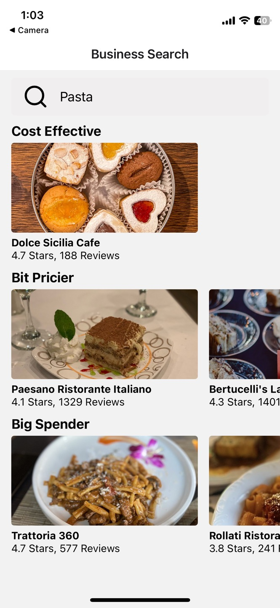
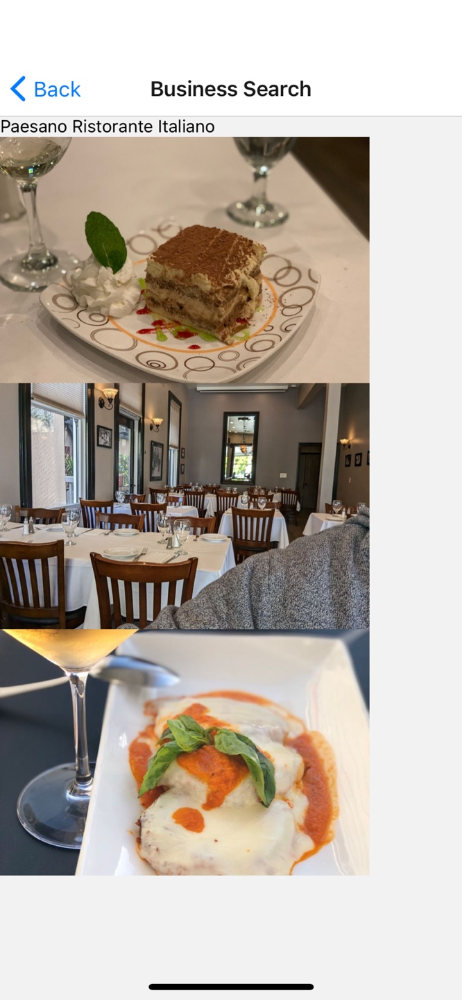
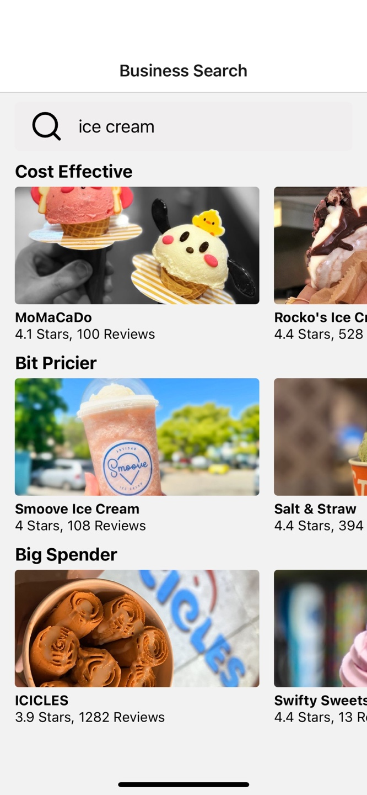

# 🍽️ Restaurant Search Mobile Application

> A React Native mobile app that helps users discover local restaurants using the Yelp Fusion API, featuring search functionality, detailed business information, and an intuitive interface.

[](https://reactnative.dev/)
[](https://developer.mozilla.org/en-US/docs/Web/JavaScript)
[](https://expo.dev/)
[](https://www.yelp.com/developers)

## 📋 Table of Contents
- [Overview](#overview)
- [Features](#features)
- [Screenshots](#screenshots)
- [Tech Stack](#tech-stack)
- [Installation](#installation)
- [API Configuration](#api-configuration)
- [What I Learned](#what-i-learned)
- [Future Enhancements](#future-enhancements)

## 🎯 Overview

This mobile application was developed as part of my **CS440 (Mobile App Development)** course at Azusa Pacific University during my sophomore year (Fall 2023). The project demonstrates my ability to:

- **Build Cross-Platform Mobile Apps**: Using React Native for iOS and Android
- **Integrate Third-Party APIs**: Consuming RESTful services with Axios
- **Design Mobile UI/UX**: Creating intuitive interfaces for touch-based interactions
- **Manage Application State**: Handling navigation and data flow in mobile apps
- **Work with Real-World Data**: Processing and displaying API responses

The app allows users to search for restaurants by cuisine type and view detailed information including ratings, reviews, and photos.

## ✨ Features

### 🔍 Search Functionality
- **Real-Time Search**: Search restaurants by cuisine type (Italian, Mexican, Thai, etc.)
- **Yelp Integration**: Fetches live restaurant data from Yelp Fusion API
- **Location-Based Results**: Displays restaurants near your current location
- **Error Handling**: Graceful handling of API errors and network issues

### 🏪 Restaurant Listings
- **Categorized Results**: Organized by price range (Budget, Mid-Range, Premium)
- **Cost-Effective Filter**: Quickly find restaurants matching your budget
- **Rating Display**: Star ratings and review counts for each restaurant
- **Restaurant Cards**: Clean, card-based UI with images and key information

### 📱 Restaurant Details
- **Photo Gallery**: View multiple images of each restaurant
- **Business Information**: Name, rating, and total review count
- **Easy Navigation**: Smooth transitions between search and detail screens

### 🎨 User Interface
- **Native Mobile Experience**: Built with React Native components
- **Responsive Design**: Adapts to different screen sizes and orientations
- **Touch Optimized**: Designed for mobile touch interactions
- **Fast Performance**: Efficient rendering with FlatList components

## 📸 Screenshots

<div style="display: flex; justify-content: space-between;">
    
    
    
</div>

## 🛠️ Tech Stack

### Mobile Framework
- **React Native** - Cross-platform mobile development framework
- **Expo** - Development platform and toolchain for React Native apps
- **React Navigation** - Routing and navigation library for screens

### API & Networking
- **Yelp Fusion API** - Restaurant data provider
- **Axios** - HTTP client for API requests

### UI Components
- **React Native Core Components** - View, Text, Image, FlatList, etc.
- **Custom Components** - Reusable UI components for consistency

## 🚀 Installation

### Prerequisites
- Node.js (v14 or higher)
- npm or yarn
- Expo CLI (`npm install -g expo-cli`)
- Expo Go app on your mobile device (iOS/Android)
- Yelp Fusion API key (free from [Yelp Developers](https://www.yelp.com/developers))

### Setup Instructions

1. **Clone the repository**
```bash
git clone https://github.com/GeroJun/Restaurant-Search-Mobile-Application.git
cd Restaurant-Search-Mobile-Application
```

2. **Install dependencies**
```bash
npm install
```

3. **Configure Yelp API** (see [API Configuration](#api-configuration) section)

4. **Start the development server**
```bash
npm start
# or
expo start
```

5. **Run on your device**
   - Install the **Expo Go** app from the App Store (iOS) or Google Play (Android)
   - Scan the QR code displayed in your terminal with your phone's camera
   - The app will open in Expo Go

## 🔑 API Configuration

### Get Your Yelp API Key

1. Visit [Yelp Fusion API](https://www.yelp.com/developers/documentation/v3/get_started)
2. Create a Yelp account or log in
3. Create a new app to receive your API key
4. Copy your API Key

### Configure the App

Create a configuration file or add your API key to the appropriate file:

```javascript
// In your API service file (e.g., src/api/yelp.js)
import axios from 'axios';

const YELP_API_KEY = 'YOUR_YELP_API_KEY_HERE';

export default axios.create({
    baseURL: 'https://api.yelp.com/v3',
    headers: {
        Authorization: `Bearer ${YELP_API_KEY}`
    }
});
```

**Security Note**: For production apps, use environment variables or secure key storage solutions instead of hardcoding API keys.

## 💡 Usage

### Searching for Restaurants

1. **Launch the app** on your device through Expo Go
2. **Enter a cuisine type** in the search bar (e.g., "pizza", "sushi", "tacos")
3. **View results** organized by price category:
   - **Cost Effective** ($, $$)
   - **Bit Pricier** ($$)
   - **Big Spender** ($$$, $$$$)
4. **Tap on any restaurant** to view detailed information and photos

### Viewing Restaurant Details

- **Scroll through photos** to see the restaurant's atmosphere and food
- **Check ratings** and review counts for quality insights
- **Navigate back** to search for more options

## 📁 Project Structure

```
Restaurant-Search-Mobile-Application/
├── src/
│   ├── api/
│   │   └── yelp.js              # Yelp API configuration
│   ├── components/
│   │   ├── SearchBar.js         # Search input component
│   │   ├── ResultsList.js       # Restaurant list component
│   │   └── ResultsDetail.js     # Detail view component
│   ├── screens/
│   │   ├── SearchScreen.js      # Main search screen
│   │   └── ResultsShowScreen.js # Restaurant details screen
│   └── hooks/
│       └── useResults.js        # Custom hook for API calls
├── App.js                       # Root component with navigation
├── app.json                     # Expo configuration
├── package.json                 # Dependencies
└── README.md                   # Documentation
```

## 📚 What I Learned

### Mobile Development Skills
- **React Native Fundamentals**: Component lifecycle, state management, and props
- **Navigation**: Implementing stack navigation with React Navigation
- **Mobile UI Patterns**: Designing for touch interfaces and mobile screen sizes
- **Cross-Platform Development**: Writing code that works on both iOS and Android
- **Performance Optimization**: Using FlatList for efficient list rendering

### API Integration
- **RESTful API Consumption**: Making HTTP requests with Axios
- **Asynchronous Programming**: Using async/await for API calls
- **Error Handling**: Managing network failures and API rate limits
- **Data Transformation**: Processing and filtering API responses
- **Authentication**: Working with API keys and bearer tokens

### Development Tools
- **Expo Workflow**: Rapid prototyping and testing with Expo Go
- **Debugging**: Using React Native Debugger and console logging
- **Version Control**: Managing code with Git
- **Mobile Testing**: Testing on physical devices via QR code scanning

### Software Engineering Practices
- **Component Architecture**: Building reusable, modular components
- **Custom Hooks**: Creating reusable logic with React hooks
- **Code Organization**: Structuring files for maintainability
- **Documentation**: Writing clear README files and code comments

## 🚀 Future Enhancements

Planned features to improve the app:

- [ ] **Map Integration** - Show restaurant locations on a map view
- [ ] **Filter Options** - Filter by distance, rating, price, open now
- [ ] **Favorites System** - Save favorite restaurants locally
- [ ] **Recent Searches** - Quick access to previous search terms
- [ ] **Restaurant Hours** - Display open/closed status and hours
- [ ] **Phone Integration** - Tap to call restaurant directly
- [ ] **Directions** - Launch Maps app for navigation
- [ ] **Reviews Section** - Display actual Yelp reviews
- [ ] **Sort Options** - Sort results by rating, distance, or reviews
- [ ] **Dark Mode** - Theme toggle for low-light conditions
- [ ] **Offline Support** - Cache recent searches and favorites
- [ ] **Social Sharing** - Share restaurant info with friends
- [ ] **User Authentication** - Personal profiles and preferences
- [ ] **Advanced Search** - Multiple filters and categories
- [ ] **Reservation Integration** - Book tables through the app

## 👤 Author

**Victor (Gero) Jun**
- 🎓 Computer Science Student @ Azusa Pacific University
- 💼 Software Engineer Intern
- 🔗 [LinkedIn](https://www.linkedin.com/in/gerojun)
- 🐱 [GitHub](https://github.com/GeroJun)

## 📝 License

This project is open source and available for educational purposes.

## 🙏 Acknowledgments

- **Yelp Fusion API** for providing restaurant data
- **Azusa Pacific University** CS440 course for project inspiration
- **React Native community** for excellent documentation and support

---

⭐ **If you found this project useful, please give it a star!**

*Developed as part of my Mobile App Development coursework | Fall 2023*
